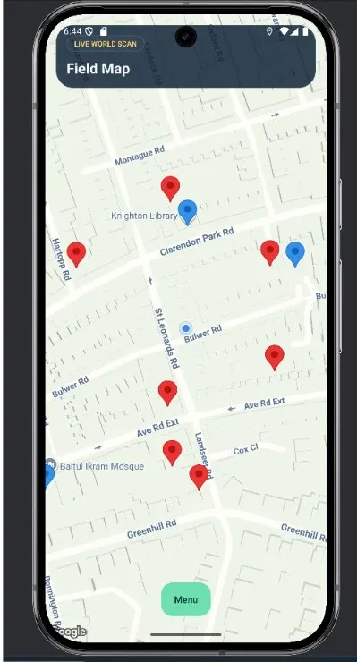
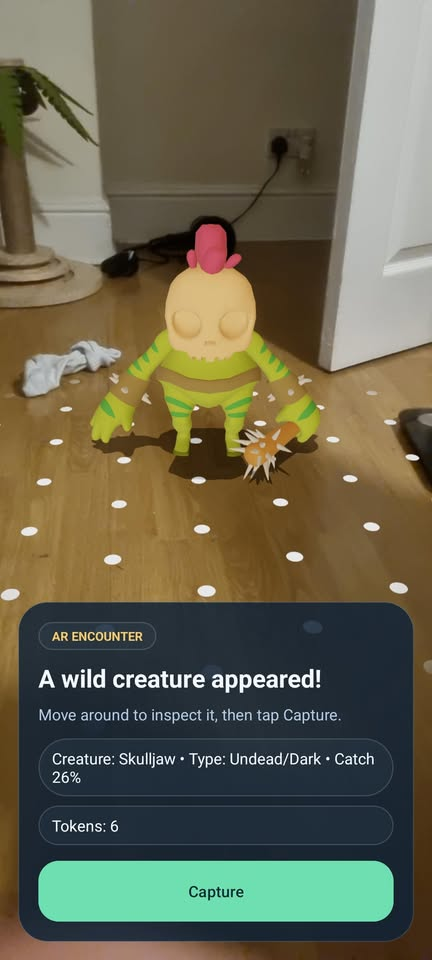
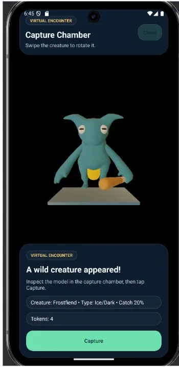
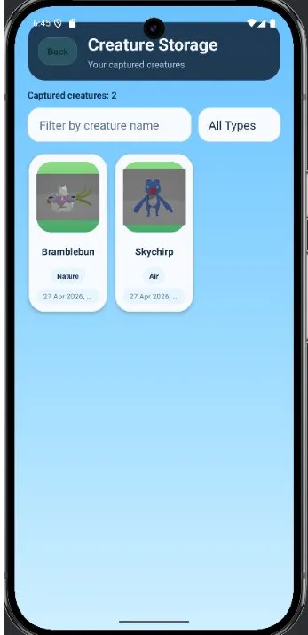
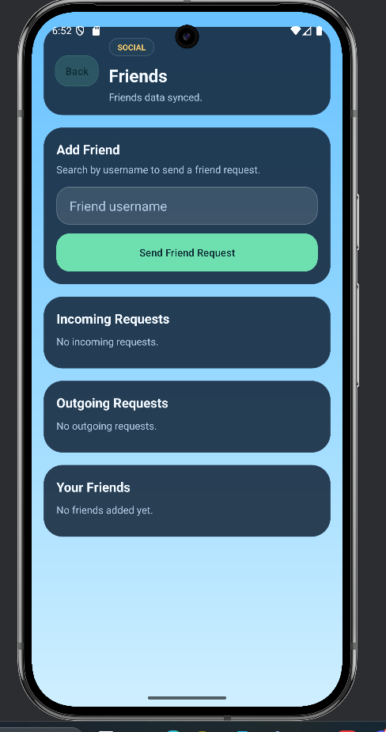
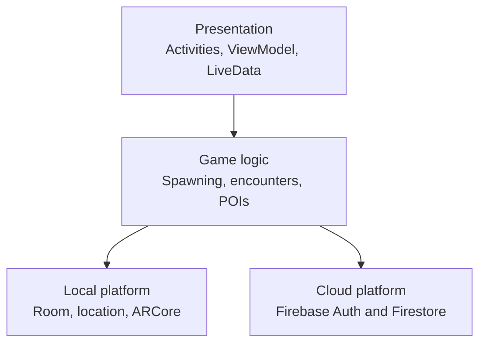

# AR Creature Explorer

An Android location-based augmented reality game that turns the surrounding area into a shared creature-catching world. Players explore a live map, collect resources from nearby points of interest, encounter creatures in AR, and retain their progress across devices.

Developed as my final-year Computer Science dissertation at the University of Leicester.

## Highlights

- Deterministic, grid-based spawning produces the same creatures for players in the same place and time without a central spawn server.
- ARCore and Sceneform anchor animated 3D creatures to detected real-world surfaces.
- A virtual encounter fallback keeps the core experience accessible on devices without suitable AR support.
- Room and LiveData manage responsive local spawn state, while Firebase stores accounts, progression, captures, and friendships.
- OpenStreetMap Overpass data powers proximity-based points of interest and resource rewards.
- Firestore transactions protect token balances and capture state from partial updates.

## Screenshots

| Live world map | AR encounter | Virtual fallback |
| --- | --- | --- |
|  |  |  |

| Creature inventory | Friends system |
| --- | --- |
|  |  |

## How it works

The world is divided into geographic cells of approximately 111 metres square. For the player's current cell and its eight neighbours, the game combines the cell identifier with a two-minute time window to seed spawn generation. This gives each client the same creature and position for a given place and time, while staggered cell offsets prevent the entire map refreshing at once.

Active spawns are stored locally and observed through LiveData. As the player moves, `SpawnScheduler` performs rate-limited refreshes on a background executor; expired spawns are removed and the map updates reactively. Long-lived player data is stored separately in Firestore.



## Features

- Email/password registration, sign-in, password reset, and account deletion
- Live Google Map with location tracking and proximity validation
- Shared deterministic creature spawns with expiry and duplicate prevention
- AR and non-AR encounter modes with probability-based captures
- Catch-token economy linked to nearby points of interest
- Persistent creature inventory and player statistics
- Friend requests, friend profiles, and recent capture activity
- Dark-themed responsive Android interface

## Technology

| Area | Technology |
| --- | --- |
| Application | Java, Android SDK, Gradle |
| Augmented reality | ARCore, Sceneform |
| Mapping and location | Google Maps SDK, Fused Location Provider |
| Local data | Room, SQLite, LiveData |
| Cloud data | Firebase Authentication, Cloud Firestore |
| External data | OpenStreetMap Overpass API |

## Project structure

```text
app/src/main/
├── java/com/emreuzum/argame/
│   ├── cloud/    Firebase repositories and cloud models
│   ├── data/     Room database, entities, DAO and repository
│   ├── game/     Spawn generation, scheduling and POI logic
│   └── *.java    Activities, adapters and view models
├── assets/       Licensed third-party 3D creature models
└── res/          Layouts, themes, images and map styling
```

The detailed development timeline is available in [docs/PROJECT_LOG.md](docs/PROJECT_LOG.md).

## Run locally

### Prerequisites

- Android Studio with JDK 11 or newer
- Android SDK 35
- A physical Android device running Android 8.0 (API 26) or later
- An ARCore-supported device for AR mode; other devices can use virtual encounters
- Your own Firebase and Google Maps projects

### Configuration

1. Clone the repository and open it in Android Studio.
2. Create a Firebase Android app with package name `com.emreuzum.argame`.
3. Enable Email/Password Authentication and create a Cloud Firestore database.
4. Download your Firebase `google-services.json` and place it in `app/`.
5. Create `local.properties` in the repository root (Android Studio normally creates it).
6. Add your Android SDK path and Google Maps API key:

```properties
sdk.dir=C\:\\Users\\YOUR_NAME\\AppData\\Local\\Android\\Sdk
GOOGLE_MAPS_API_KEY=YOUR_RESTRICTED_MAPS_API_KEY
```

On macOS or Linux, use the appropriate SDK path, for example `sdk.dir=/Users/YOUR_NAME/Library/Android/sdk`.

Restrict the Maps key to the Android application package and signing certificate before running the app. Never commit `local.properties` or `google-services.json`; both are ignored by Git.

7. Sync Gradle and run the `app` configuration on your device.
8. Allow camera and precise location permissions when prompted.

## Validation

The final application was manually tested across the full gameplay loop: account creation, live map navigation, POI collection, AR and virtual encounters, capture persistence, inventory management, friendships, and account deletion.

During dissertation evaluation:

- all seven defined functional objectives were met;
- 9-12 active creatures were observed during normal spawn-system testing;
- AR surface detection was tested under multiple indoor lighting conditions and brief outdoor use;
- deterministic generation, expiry, duplicate prevention, and geographic consistency were checked at logic level;
- no crashes were observed during the reported testing period.

Automated coverage is currently limited, so expanding unit and instrumentation tests is a priority for future work.

## Design decisions and limitations

- Frequently changing spawn state remains local to reduce Firestore traffic and latency. Authentication, inventory, and social functionality still require network connectivity.
- The virtual encounter mode improves device compatibility but is less immersive than AR.
- Spawns are geographically consistent but do not yet adapt to terrain, weather, or time of day.
- This is an academic prototype, not a production service. Commercial deployment would require stronger backend validation, anti-location-spoofing measures, broader device testing, privacy controls, and formal security review.

## Asset attribution

Creature models are derived from Quaternius' *Ultimate Monsters* pack, made available for free commercial use:

> Quaternius (2022), [Ultimate Monsters](https://quaternius.com/packs/ultimatemonsters.html).

The source code is shared for portfolio and educational review. Third-party assets remain subject to their original licence terms.
